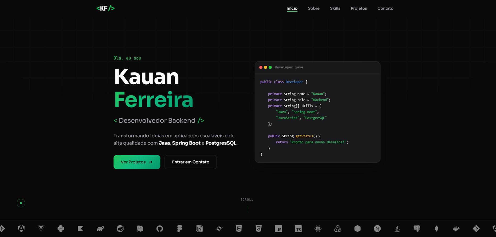

# 💼 Portfólio - Kauan Ferreira

<div align="center">


**Portfólio pessoal desenvolvido para apresentar meus projetos, habilidades e experiência como Desenvolvedor Backend.**

[🔗 Visite o Portfólio](https://portifolio-kappa-rose.vercel.app/) • [📧 Contato](mailto:kauanferreira3011@gmail.com) • [💼 LinkedIn](https://www.linkedin.com/in/kauan-santos-ferreira)

</div>

---

## 📸 Preview

<div align="center">
  
</div>

---

## ✨ Features

- 🎨 **Design Moderno** - Interface dark mode com acentos em verde
- 📱 **Responsivo** - Adaptado para desktop, tablet e mobile
- 🖱️ **Cursor Personalizado** - Cursor customizado com animações suaves
- 🎠 **Carrossel de Tecnologias** - Animação infinita com ícones das principais techs
- ⚡ **Performance** - HTML/CSS/JS puro, sem frameworks pesados
- 🔍 **SEO Otimizado** - Meta tags configuradas para melhor indexação
- 📄 **Download de CV** - Botão para baixar currículo em PDF

---

## 🛠️ Tecnologias Utilizadas

| Tecnologia | Uso |
|------------|-----|
| **HTML5** | Estrutura semântica |
| **CSS3** | Estilização, animações e responsividade |
| **JavaScript** | Interatividade e efeitos |
| **Google Fonts** | Tipografia (Sora + JetBrains Mono) |
| **Devicon** | Ícones de tecnologias |

---

## 📁 Estrutura do Projeto

```
portfolio/
├── index.html              # Página principal
├── styles.css              # Estilos e animações
├── script.js               # Interatividade
├── curriculo-kauan-ferreira.pdf  # Currículo para download
└── README.md               # Documentação
```

---

## 🚀 Como Executar Localmente

1. **Clone o repositório**
   ```bash
   git clone https://github.com/Kauan-FR/portfolio.git
   ```

2. **Acesse a pasta**
   ```bash
   cd portfolio
   ```

3. **Abra no navegador**
   - Abra o arquivo `index.html` diretamente, ou
   - Use uma extensão como Live Server no VS Code

---

## 📦 Deploy

Este projeto está hospedado na **Vercel**:

[](https://vercel.com/new/clone?repository-url=https://github.com/Kauan-FR/portfolio)

---

## 📫 Contato

<div align="center">

[](mailto:kauanferreira3011@gmail.com)
[](https://www.linkedin.com/in/kauan-santos-ferreira)
[](https://github.com/Kauan-FR)
[_99136--0275-25D366?style=for-the-badge&logo=whatsapp&logoColor=white)](https://wa.me/5579991360275)

</div>

---

## 📝 Licença

Este projeto está sob a licença MIT. Veja o arquivo [LICENSE](LICENSE) para mais detalhes.

---

<div align="center">

**Desenvolvido por [Kauan Ferreira](https://github.com/Kauan-FR)**

</div>
